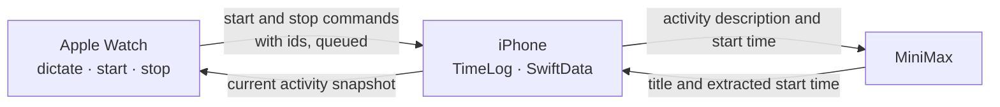

<div align="center">


# Chronoception

**A personal time-tracking app based on the Lyubishchev method.**

A time-tracking app for iPhone and Apple Watch, with records stored in a local iPhone database.


[](LICENSE)

[简体中文](README.zh-CN.md) · English

&nbsp;&nbsp;

</div>

> [!NOTE]
> The app's interface is in Simplified Chinese only.

## Background

On New Year's Day 1916, the Soviet biologist Alexander Lyubishchev (1890–1972) began recording where his time went: what he did each day and how long each thing took, summed up every month and every year. He kept it up until his death, 56 years later. Daniil Granin told his story in *This Strange Life*.

Chronoception reduces the recording workflow to entering an activity description, starting the timer, and stopping it. Background title processing, gap backfilling, and export reduce manual entry and organization.

*Chronoception* means the perception of time. The project uses ongoing activity records to support reviews of time allocation and comparisons between estimated and actual duration.

## Design principles

1. **Minimal recording workflow.** Enter or dictate an activity description, start the timer, and stop it when the activity ends. Optional title extraction and start-time adjustments run in the background without additional confirmation.
2. **Activity descriptions without categories.** Records use specific activity descriptions without a separate categorization step.
3. **Record retention.** Stopping the timer retains the activity record, with a minimum completed duration of one minute. Unrecorded periods appear as gaps.
4. **Manual edits take precedence.** Background processing does not overwrite manually edited titles or start times. Original input is retained.
5. **Local storage.** Records are stored on the iPhone without an account, a project-operated data server, or behavioral tracking. JSON and CSV export are supported. When MiniMax processing is enabled, activity descriptions and start times are sent to its API.

## Usage

### iPhone

<table>
  <tr>
    <td align="center" width="33%"><br><b>① Write what you're doing</b></td>
    <td align="center" width="33%"><br><b>② Tap start; the timer runs</b></td>
    <td align="center" width="33%"><br><b>③ Tap a gap to backfill it</b></td>
  </tr>
</table>

- **Start**: write a line in the start bar at the bottom (or dictate it with the keyboard's mic) and tap ▶. The timer starts at once, and the line becomes the title.
- **Stop**: whatever is running stays pinned at the top; tap 结束 (stop) when you're done. Starting something new also stops the previous event. Stopping always leaves an entry, at least one minute long.
- **Backfill and edit**: time you didn't log shows up as a gap. Tap it to backfill, with the start and end already filled in. Tap an entry to change its title or times; swipe left to delete, swipe right to split.
- **Set an end time**: Edit the running event, switch off 进行中 (running), and set when it ended.
- **History**: page back through earlier days; each day shows how much time was logged and how much wasn't.

### Apple Watch

<table>
  <tr>
    <td align="center" width="50%"><br><b>Tap the mic and say it</b></td>
    <td align="center" width="50%"><br><b>Timing; tap stop when done</b></td>
  </tr>
</table>

- Open the app, tap the mic, say what you're about to do, and confirm: the timer starts. Tap 结束 (stop) when you're done.
- It uses system dictation. If the input screen opens with Scribble or the keyboard, tap its mic once; watchOS remembers, and from then on it opens straight into dictation.
- The phone keeps the log. Starts and stops on the watch go straight to the phone, and starts, stops and tidied titles on the phone flow back to the watch. When the phone is out of reach, the watch queues its actions and delivers them in order later; an action delivered twice counts once.

### Background tidying (MiniMax, optional)

Configure a MiniMax API key in Settings to enable background extraction of a concise title and any explicitly stated start time:

| Original input | Processing result |
| --- | --- |
| 嗯现在开始写论文第三章 ("um, starting chapter three of the thesis now") | 写论文第三章 ("write thesis chapter three") |
| 从九点开始看文献 ("been reading papers since nine") | 看文献 ("read papers"), with the start moved to 09:00 |

- An explicitly stated earlier start updates the current activity's start and the previous activity's end. Manually edited fields are preserved.
- Recording remains available without an API key, using the original input as the title. Offline records are saved first; processing is retried when connectivity returns.
- Requests contain only the activity description and start time. The API key is stored in the current iPhone's Keychain.

### Export

Settings exports the whole log as **JSON** (everything, including your original words) or **CSV** (opens directly in Numbers or Excel).

<p align="center"></p>

## Architecture

- **SwiftUI** on iOS 26 and watchOS 26. Simplified Chinese UI, an ivory, warm ink, and clay palette, and dark mode.
- **SwiftData** with a `VersionedSchema`; real data on the device only changes shape through migrations.
- **ChronoceptionKit**: a shared Swift 6 package containing data models and core logic for timelines, title processing, export, and the sync protocol. Unit tests use Swift Testing and run on macOS.
- **WatchConnectivity**: without iCloud, the phone is the single source of truth. The watch sends start and stop commands carrying the event's id, which may be queued, late or duplicated; the phone sends back a snapshot of what's running.
- **MiniMax** through its OpenAI-compatible Chat Completions API, tidying titles in the background.



## Build and run

The build environment requires macOS, Xcode 26 or later, and [XcodeGen](https://github.com/yonaskolb/XcodeGen). Current development uses Xcode 27. Free Apple ID provisioning expires after seven days and requires signing and installation again. Installing over the existing app with the same identifier preserves local data; deleting the app removes its local data.

```bash
brew install xcodegen
git clone https://github.com/MuhangHE/Chronoception.git
cd Chronoception
cp Config/Local.xcconfig.example Config/Local.xcconfig
xcodegen generate
open Chronoception.xcodeproj
```

Fill in two values in `Config/Local.xcconfig`, which is git-ignored:

- `DEVELOPMENT_TEAM`: the development team ID. After signing in to Xcode and creating a development certificate, query it with
  ```bash
  security find-certificate -c "Apple Development" -p | openssl x509 -noout -subject
  ```
  Use the 10-character team identifier in the certificate subject’s `OU=` field.
- `BUNDLE_ID_PREFIX`: the application identifier prefix in reverse-DNS format, such as `io.github.yourname`.

Select the `Chronoception` scheme and target iPhone in Xcode, then press ⌘R to build and run. The watch app is embedded in the iPhone app. The `ChronoceptionWatch` scheme can also run directly on the target watch.

```bash
# Run unit tests on macOS
swift test --package-path Packages/ChronoceptionKit
```

Debug builds support the following launch arguments (Edit Scheme → Run → Arguments):

| Argument | What it does |
| --- | --- |
| `-demo` | Loads in-memory sample data without reading or writing actual records. README screenshots use this mode. |
| `-fakeParser` | Uses a simulated implementation for background processing without an API key or network connection. |

## License

[MIT](LICENSE)
