<div align="center">

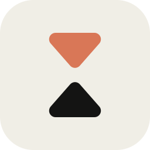

# Chronoception

**基于柳比歇夫时间记录法的个人时间管理应用。**

支持 iPhone 和 Apple Watch，以 iPhone 本地数据库保存时间记录。


[](LICENSE)

简体中文 · [English](README.md)

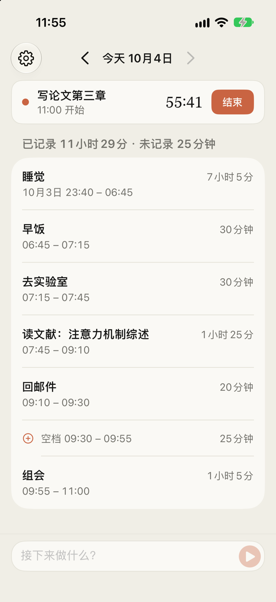&nbsp;&nbsp;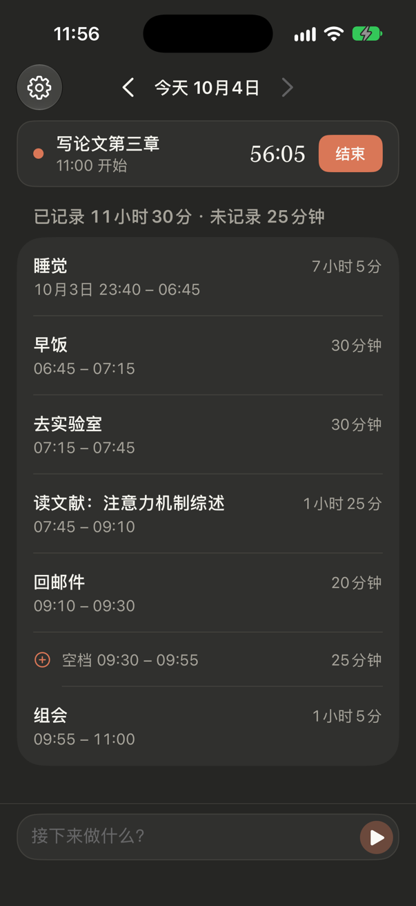

</div>

## 项目背景

苏联生物学家亚历山大·柳比歇夫（1890–1972）自 1916 年起持续记录每日活动及其耗时，并按月、按年汇总，累计记录 56 年。格拉宁在《奇特的一生》中介绍了这一方法。

Chronoception 将记录流程简化为输入活动描述、开始计时和结束计时，并提供后台标题整理、空档补录和记录导出功能，减少手动记录与整理的操作。

Chronoception 意为「时间知觉」，即对时间流逝的感知。项目旨在通过持续记录，为回顾时间分配和比较主观时长与实际耗时提供依据。

## 设计原则

1. **简化记录流程。** 输入或听写活动描述后开始计时，活动完成后结束计时。启用后台整理后，标题提取和开始时间修正在后台执行，无需额外确认。
2. **直接记录活动。** 不设置活动分类，以具体描述作为记录内容，减少输入步骤。
3. **保留完整记录。** 结束计时后保留活动记录，已完成记录的最短时长为 1 分钟。未记录的时段显示为空档。
4. **保留手动修改。** 后台整理不覆盖手动修改过的标题或开始时间，并保留原始输入。
5. **本地存储。** 时间记录保存在 iPhone，无需账号，不使用自建数据服务器或行为追踪服务。支持 JSON 和 CSV 导出；启用 MiniMax 后台整理时，活动描述和开始时间会发送至其 API。

## 使用说明

### iPhone

<table>
  <tr>
    <td align="center" width="33%">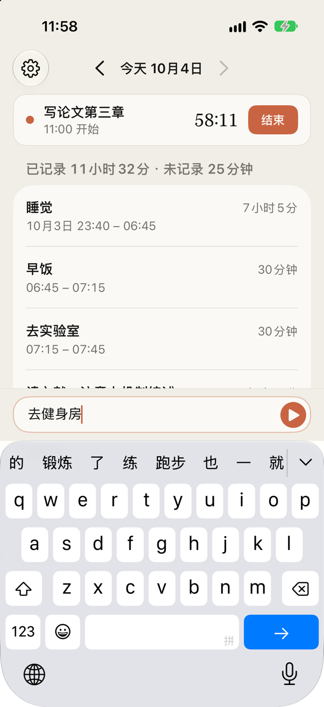<br><b>① 输入活动描述</b></td>
    <td align="center" width="33%">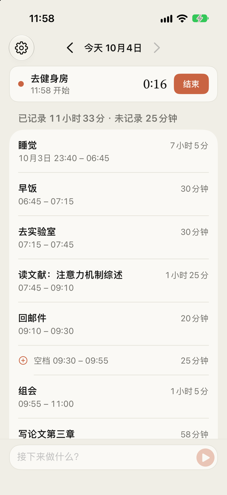<br><b>② 开始计时</b></td>
    <td align="center" width="33%">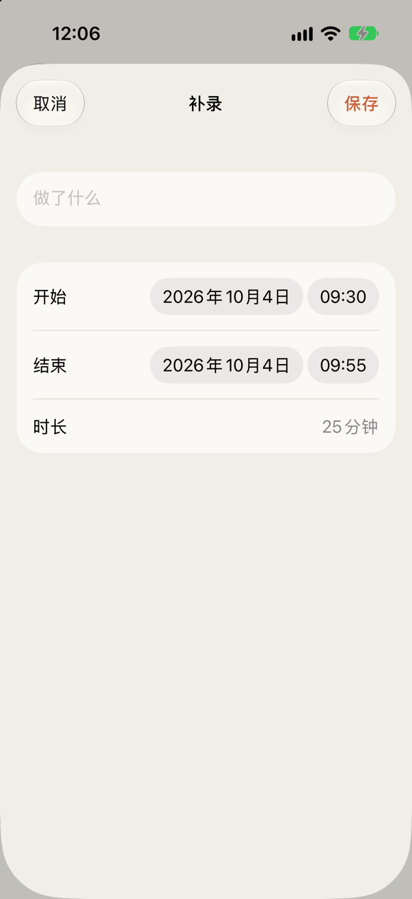<br><b>③ 补录空档</b></td>
  </tr>
</table>

- **开始计时**：在底部开始栏输入活动描述，或使用系统键盘听写。点击 ▶ 开始计时，原始输入作为初始标题。
- **结束计时**：当前活动置顶显示，点击「结束」保存记录。开始新活动时，上一项活动自动结束。已完成记录的最短时长为 1 分钟。
- **补录与编辑**：点击空档打开补录页面，起止时间自动填入。点击已有记录可修改标题和时间；左滑删除，右滑拆分。
- **补设结束时间**：编辑当前活动，关闭「进行中」，填写实际结束时间。
- **历史记录**：通过顶部日期导航查看历史时间线。每天分别汇总已记录和未记录的时长。

### Apple Watch

<table>
  <tr>
    <td align="center" width="50%">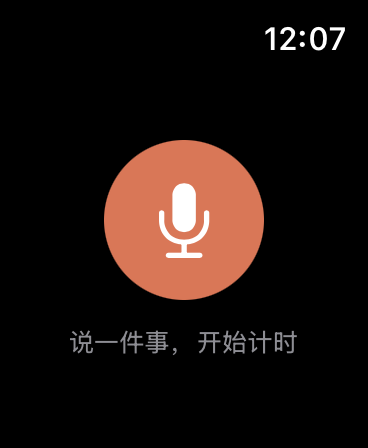<br><b>听写活动描述</b></td>
    <td align="center" width="50%">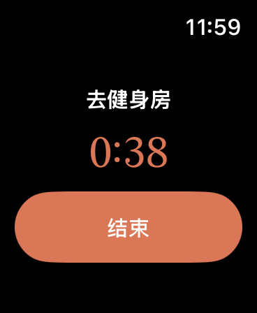<br><b>查看计时与结束活动</b></td>
  </tr>
</table>

- 打开应用，点击麦克风输入活动描述，确认后开始计时；点击「结束」完成记录。
- 语音输入使用系统听写。输入界面显示手写或键盘时，可点击麦克风切换；watchOS 会保留所选输入方式。
- iPhone 保存完整记录，Apple Watch 发送开始和结束指令，并接收当前活动状态及整理后的标题。连接不可用时，指令进入队列，恢复连接后按顺序发送；重复指令按同一操作处理。

### 小组件与表盘

<table>
  <tr>
    <td align="center" width="50%">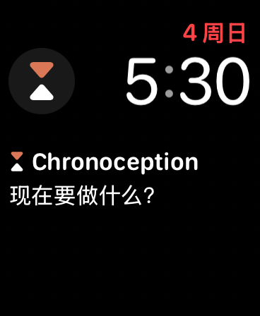<br><b>点击复杂功能直接听写</b></td>
    <td align="center" width="50%">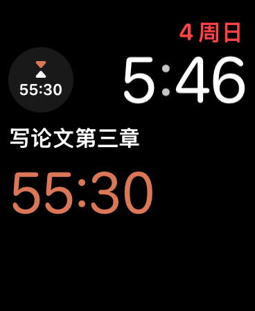<br><b>在表盘上查看计时</b></td>
  </tr>
  <tr>
    <td align="center" width="50%">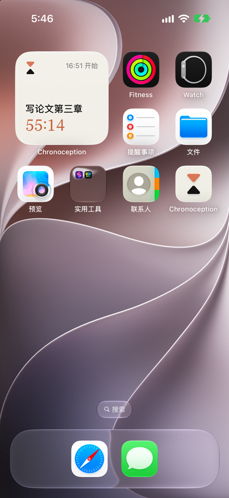<br><b>主屏幕小组件</b></td>
    <td align="center" width="50%">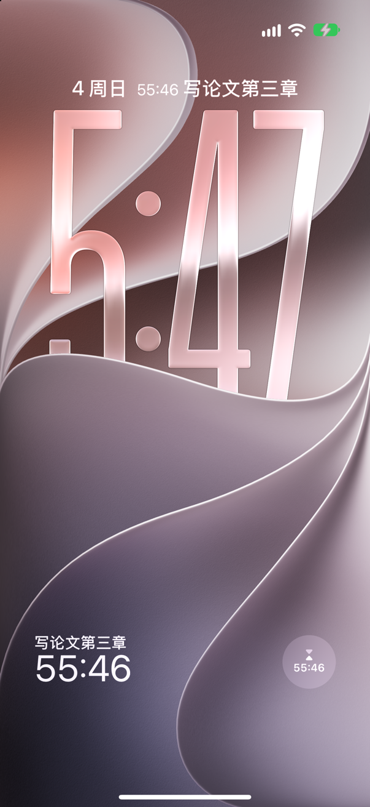<br><b>锁定屏幕小组件</b></td>
  </tr>
</table>

- **Apple Watch**：可将 Chronoception 作为复杂功能添加到表盘，支持圆形、角落、长方形和单行样式。没有进行中的活动时，点击复杂功能直接进入听写，说出活动描述并确认后开始计时；有活动进行时显示标题和实时计时，点击可打开应用并结束活动。
- **iPhone**：支持小尺寸主屏幕小组件，以及锁定屏幕的圆形、长方形和单行小组件。点击后打开应用，开始栏自动弹出键盘，可直接输入或使用键盘听写。
- 在任一设备上开始或结束活动后，小组件随之更新。手表应用未打开时，iPhone 发出的更新也会在后台唤醒手表应用，刷新表盘。
- 也可通过 `chronoception://start` 打开开始栏，例如在快捷指令中使用。

### 后台整理（MiniMax，可选）

在设置中配置 MiniMax API Key 后，应用在活动开始时提交后台整理请求，从原始输入中提取简洁标题及明确提及的开始时间：

| 原始输入 | 整理结果 |
| --- | --- |
| 嗯现在开始写论文第三章 | 写论文第三章 |
| 从九点开始看文献 | 看文献，开始时间改为 09:00 |

- 原始输入包含更早的开始时间时，调整当前活动的开始时间及上一项活动的结束时间；手动修改过的字段不被覆盖。
- 未配置 API Key 时，记录功能仍可使用，原始输入保留为标题。网络不可用时先保存记录，恢复连接后重试整理。
- 请求仅包含活动描述和开始时间。API Key 保存在当前 iPhone 的钥匙串中。

### 导出

在设置中导出全部记录：**JSON** 包含完整数据及原始输入；**CSV** 可用于 Numbers 或 Excel。

<p align="center">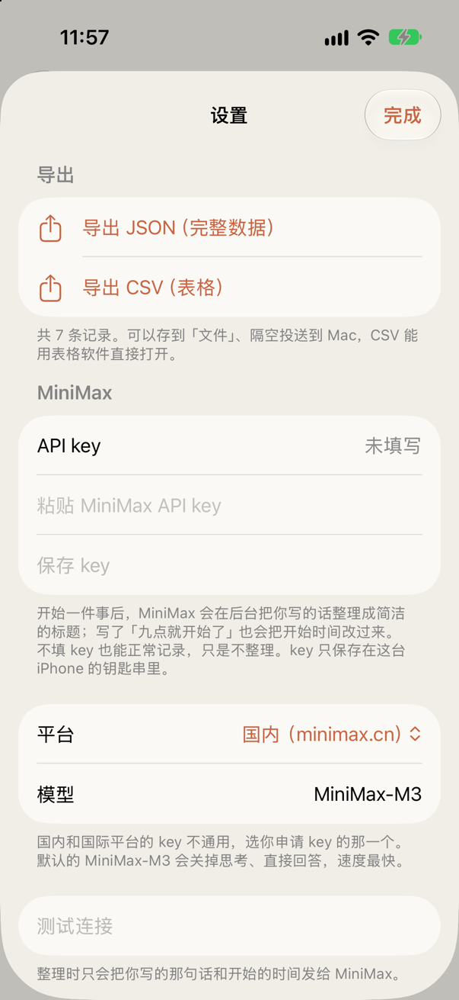</p>

## 技术架构

- **SwiftUI**：面向 iOS 26 和 watchOS 26，提供简体中文界面及深色模式。配色使用象牙白、暖墨色和陶土橙。
- **SwiftData**：使用 `VersionedSchema` 管理数据结构，持久化数据结构的变更通过版本迁移完成。
- **ChronoceptionKit**：iPhone 和 Apple Watch 共用的 Swift 6 包，包含数据模型及时间线、标题整理、导出和同步协议等核心逻辑。使用 Swift Testing，在 Mac 上运行单元测试。
- **WatchConnectivity**：以 iPhone 数据为准，不使用 iCloud 同步。手表发送携带活动 ID 的开始和结束指令，手机端处理延迟及重复指令，并将当前活动状态以快照形式同步至手表。
- **MiniMax**：通过 OpenAI 兼容的 Chat Completions 接口执行后台标题整理。
- **WidgetKit**：同一套小组件代码（`Widgets/`）分别编译为 iPhone 和 Apple Watch 扩展。两端应用将当前活动写入 App Group，变化时刷新小组件。iPhone 同时通过 `transferCurrentComplicationUserInfo` 向手表发送快照，在后台唤醒手表应用以更新复杂功能。

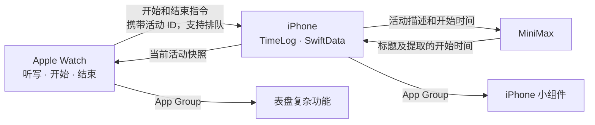

## 构建与运行

构建环境为 macOS、Xcode 26 或更新版本，以及 [XcodeGen](https://github.com/yonaskolb/XcodeGen)；当前开发使用 Xcode 27。使用免费 Apple ID 进行设备签名时，签名有效期为 7 天，到期后需重新签名并安装。保留现有应用、使用相同标识覆盖安装可保留本地数据；删除应用会移除其本地数据。

```bash
brew install xcodegen
git clone https://github.com/MuhangHE/Chronoception.git
cd Chronoception
cp Config/Local.xcconfig.example Config/Local.xcconfig
xcodegen generate
open Chronoception.xcodeproj
```

在 `Config/Local.xcconfig` 中配置以下字段。该文件已加入 Git 忽略规则：

- `DEVELOPMENT_TEAM`：开发团队 ID。在 Xcode 中登录 Apple ID 并生成开发证书后，可通过以下命令查询：

  ```bash
  security find-certificate -c "Apple Development" -p | openssl x509 -noout -subject
  ```

  使用证书主题中 `OU=` 对应的 10 位团队标识。
- `BUNDLE_ID_PREFIX`：应用标识符前缀，使用反向域名格式，例如 `io.github.yourname`。

自动签名会注册 4 个 App ID（两个应用及各自的小组件扩展）和 App Group `group.<BUNDLE_ID_PREFIX>.chronoception`，免费 Apple ID 即可使用。

在 Xcode 中选择 `Chronoception` scheme 和目标 iPhone，按 ⌘R 构建并运行。Apple Watch 应用内嵌于 iPhone 应用，也可选择 `ChronoceptionWatch` scheme 在目标手表上运行。

```bash
# 在 Mac 上运行单元测试
swift test --package-path Packages/ChronoceptionKit
```

Debug 构建支持以下启动参数（Edit Scheme → Run → Arguments）：

| 参数 | 作用 |
| --- | --- |
| `-demo` | 加载内存中的演示数据，不读写实际记录。README 截图使用此模式生成。 |
| `-fakeParser` | 使用模拟实现执行后台整理，无需 API Key 或网络连接。 |

## 许可

[MIT](LICENSE)
